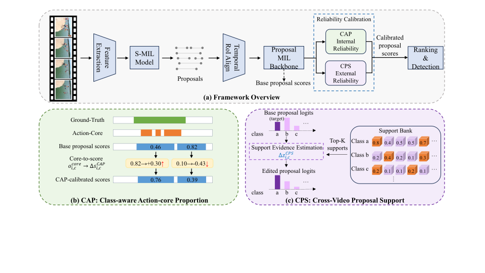

<div align="center">

# CAPSNet

### Calibrating Proposal-Score Reliability for Weakly Supervised Temporal Action Localization

Proposal-level WTAL with internal action-core calibration and external cross-video proposal support.

<p>
  
  
  
  
</p>

</div>

<p align="center">
  
</p>

## Overview

CAPSNet is a dual reliability calibration framework for proposal-level weakly-supervised temporal action localization (WTAL). It keeps the proposal-level prediction interface unchanged and calibrates proposal-class scores before final ranking. The core observation is that a high proposal score may come from context, a short discriminative fragment, or a class absent from the video but correlated with the scene of a present action.

CAPSNet calibrates proposal-score reliability from two complementary views:

- **Class-Aware Action-Core Proportion (CAP)** estimates class-specific action-core dominance over ordered RoI bins, separates action-core evidence from contextual response, and selectively corrects under-confident proposals supported by strong action-core evidence.
- **Cross-Video Proposal Support (CPS)** retrieves same-class support proposals from other videos and contrasts them with absent-class supports to calibrate logits affected by context or class confusion.
- **Proposal-level calibration** keeps the proposal source and detection pipeline unchanged, then re-ranks proposal-class pairs with internal and external reliability cues.

## Abstract

Weakly-supervised temporal action localization (WTAL) aims to localize action instances using only video-level labels. Proposal-level MIL reduces the train-test mismatch of snippet-based WTAL by scoring temporal proposals during both training and inference. The proposal score itself, however, can still be unreliable: a high response may come from contextual evidence, a short discriminative fragment, or a class absent from the video but correlated with the scene of a present action. In this paper, we propose a dual reliability calibration framework (CAPSNet) for proposal-level WTAL. CAPSNet keeps the proposal-level prediction interface unchanged and calibrates proposal scores from two complementary views. Class-Aware Action-Core Proportion (CAP) estimates class-specific action-core dominance over ordered RoI bins, separates action-core evidence from contextual response, and selectively corrects under-confident proposals supported by strong action-core evidence. Cross-Video Proposal Support (CPS) retrieves same-class support proposals from other videos and contrasts them with absent-class supports to calibrate logits affected by context or class confusion. Together, CAP and CPS provide internal and external reliability cues for calibrated proposal scoring. Our model achieves better detection performance than previous state-of-the-art WTAL methods on standard benchmarks.

## Results

### THUMOS14

| Method | Backbone | mAP@0.1 | mAP@0.2 | mAP@0.3 | mAP@0.4 | mAP@0.5 | mAP@0.6 | mAP@0.7 | AVG 0.1:0.5 | AVG 0.3:0.7 | AVG 0.1:0.7 |
| --- | --- | ---: | ---: | ---: | ---: | ---: | ---: | ---: | ---: | ---: | ---: |
| CAPSNet | P-MIL | 73.6 | 68.7 | 60.4 | 50.5 | 41.2 | 28.4 | 16.0 | 58.9 | 39.3 | 48.4 |
| CAPSNet | SEAL | 79.8 | 74.9 | 67.3 | 56.2 | 44.9 | 32.2 | 19.3 | 64.6 | 44.0 | 53.5 |

### ActivityNet v1.3

| Method | mAP@0.5 | mAP@0.75 | mAP@0.95 | AVG |
| --- | ---: | ---: | ---: | ---: |
| CAPSNet | 43.3 | 26.8 | 6.2 | 27.0 |

## Requirements

Experiments are run on an NVIDIA RTX 3090 GPU. Main library versions:

| Library | Version |
| --- | --- |
| Python | 3.10.19 |
| CUDA | 12.1 |
| PyTorch | 2.1.2 |
| torchvision | 0.16.2 |
| NumPy | 1.26.4 |
| pandas | 2.3.3 |
| joblib | 1.5.3 |
| TensorBoard | 2.20.0 |

## Data Preparation

Place THUMOS14 features and annotations under `--dataset_root` with the following layout:

```text
Thumos14reduced/
|-- Thumos14reduced-I3D-JOINTFeatures.npy
`-- Thumos14reduced-Annotations/
    |-- labels_all.npy
    |-- classlist.npy
    |-- subset.npy
    |-- videoname.npy
    `-- Ambiguous_test.txt
```

Place external proposal JSON files under the running directory:

```text
proposals/
|-- detection_result_base_train.json
`-- detection_result_base_test.json
```

Each proposal item should contain at least:

```json
{
  "segment": [12.5, 18.3],
  "label": "ActionClass",
  "score": 0.91
}
```

For THUMOS14, CAPSNet uses proposal boundaries from the external proposal source. Proposal labels and scores are not required by the core THUMOS14 proposal scorer.

## Usage

### Train on THUMOS14

Run from the THUMOS14 experiment directory so that relative `proposals/` paths resolve correctly:

```bash
python main.py --exp_dir run_2  --max_epoch 400 --interval 5
```

### Evaluate on THUMOS14

```bash
python main.py --run_type test --pretrained_ckpt outputs/ckpt/best_model.pkl

```

## Acknowledgements

This project builds on proposal-level MIL for weakly-supervised temporal action localization, external S-MIL proposal generation, and the SEAL WTAL backbone used in the stronger-backbone experiments. We thank the authors of the public WTAL datasets, feature releases, and evaluation protocols used by the community.

## License

No license file is included in this snapshot. Please contact the repository owner before redistributing or using the code outside research evaluation.
